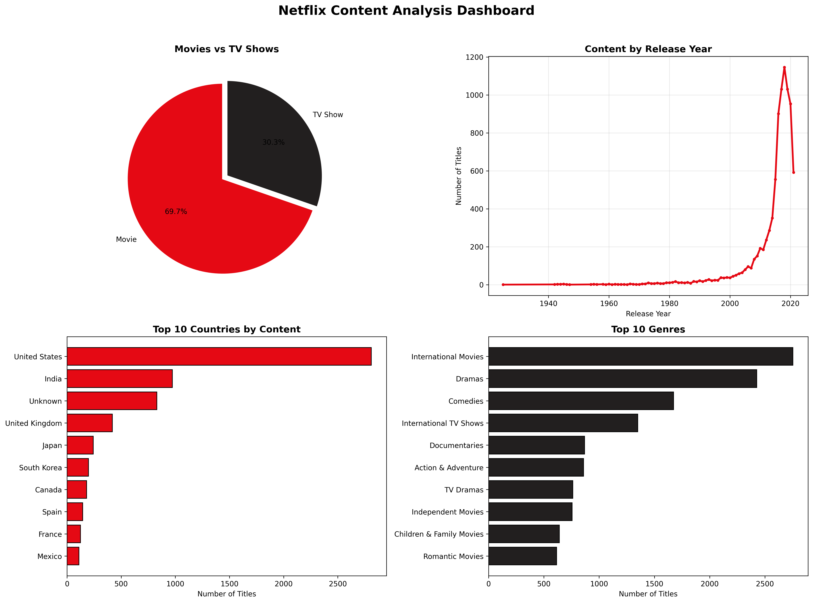

# Netflix Content Analysis

Exploratory Data Analysis (EDA) of Netflix's movies and TV shows dataset.

## Dataset

- **Source:** [Netflix Movies and TV Shows — Kaggle](https://www.kaggle.com/datasets/shivamb/netflix-shows)
- **Records:** ~8,800 titles

## What This Project Covers

- Data cleaning (handling missing values in director, cast, and country fields)
- Distribution of Movies vs TV Shows
- Content trends by release year
- Top 10 countries producing content
- Top 10 genres on the platform

## Dashboard Preview

## Key Findings

- Movies make up 69.7% of Netflix's library, TV Shows 30.3%
- Content addition peaked between 2016-2019
- The United States is the leading content producer
- International Movies and Dramas are the most common genres

## Tools Used

Python, Pandas, NumPy, Matplotlib

## Files

- `netflix_analysis.ipynb` — Full notebook with code, visualizations, and findings
- `netflix_dashboard.png` — Combined dashboard visualization
